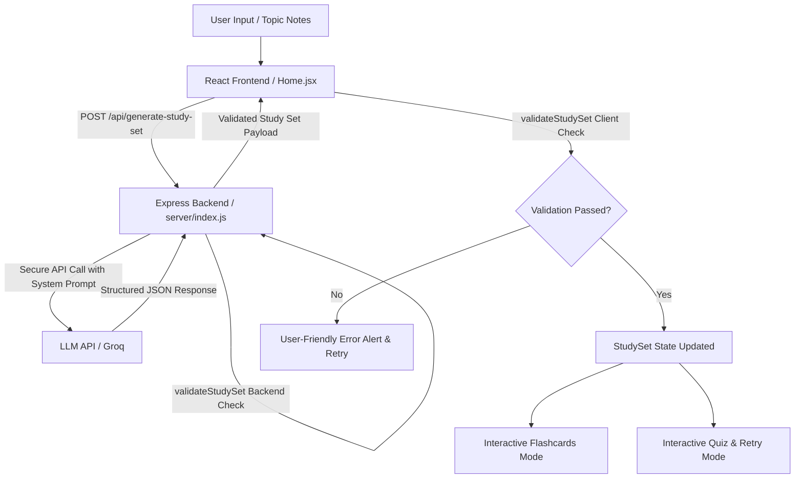

# StudyMate

StudyMate is an interactive, AI-powered study assistant that transforms free-form notes and topics into structured flashcards and self-scoring quizzes in seconds.

---

## Overview

StudyMate helps students and learners rapidly synthesize raw study materials, lecture notes, or complex topics into active recall flashcards and knowledge-checking quizzes. The app features a resilient AI data pipeline with strict schema validation, defensive backend architecture, race-condition protection, and accessible study modes.

---

## Features

- **AI-Generated Flashcards**: Automatically extracts core concepts, terms, and definitions into concise, high-yield flashcard decks.
- **Interactive 3D Flashcards**: Flip cards using mouse clicks or keyboard navigation (`Space` / `Enter`), with full previous/next navigation, step indicators, and a completion review trigger.
- **AI-Generated Multiple-Choice Quizzes**: Generates 4-option multiple-choice questions directly assessing comprehension of the input material.
- **Instant Quiz Scoring & Feedback**: Immediate visual evaluation highlighting correct answers in green and incorrect selections in red with explanatory text (independent of color alone for accessibility).
- **Targeted Wrong-Answer Retry**: Isolates missed questions into a dedicated sub-quiz session without making additional AI requests, preserving original options and answers.
- **Robust Error & Loading States**: Animated progressive loading cards with informative copy, alongside resilient error handling with one-click retry.
- **Responsive & Accessible UI**: Responsive layout tested from mobile devices (320px, 375px) to desktops (1024px+), complete with visible `:focus-visible` states and accessible ARIA attributes.

---

## Tech Stack

- **Frontend**: React 18 (Functional Components, Hooks), Vite 5, Vanilla CSS Design System
- **Backend API**: Node.js, Express, CORS, Dotenv
- **AI / LLM Integration**: Groq API (High-speed inference)
- **Validation**: Custom Central Schema Validation Layer (`validateStudySet`)
- **Typography & Icons**: Inter (Google Fonts), Semantic SVG Icons

---

## Setup

### Prerequisites
- Node.js (v18 or higher recommended)
- npm (Node Package Manager)

### Installation & Running Locally

1. **Clone the repository**:
   ```bash
   git clone https://github.com/adarsh062/Study-Assistant.git
   cd Study-Assistant
   ```

2. **Install dependencies**:
   ```bash
   npm install
   ```

3. **Configure environment variables**:
   Create a `.env` file in the project root:
   ```bash
   cp .env.example .env
   ```
   Add your API key:
   ```env
   PORT=5000
   GROQ_API_KEY=your_actual_api_key_here
   ```

4. **Start the application**:
   To run both backend server and frontend dev server concurrently:
   ```bash
   npm run dev:all
   ```

   Alternatively, run in two separate terminal tabs:
   ```bash
   # Terminal 1: Backend Server (Port 5000)
   npm run server

   # Terminal 2: Frontend Vite Dev Server (Port 5173)
   npm run dev
   ```

5. **Open in browser**:
   Navigate to `http://localhost:5173`.

6. **Run Test Suites**:
   ```bash
   npm test
   ```

---

## Environment Variables

| Variable | Required | Description |
|---|---|---|
| `PORT` | Optional (default: `5000`) | Port on which the Express server listens. |
| `GROQ_API_KEY` | **Required** | Secret API key used by the backend server to communicate with the AI provider. |
| `GROQ_MODEL` | Optional | Groq model identifier (defaults to `openai/gpt-oss-120b`). |

> **Security Note**: `GROQ_API_KEY` is kept strictly on the Node.js backend server. It is never exposed in client bundles or committed to Git.

---

## How It Works



1. **User input**: The user types or pastes notes into the textarea, or clicks a sample topic chip.
2. **React client**: Submits the text via an in-flight cancellable fetch request (`AbortController` + `activeRequestIdRef`).
3. **Backend API**: The Express server validates the payload and calls the LLM with a strict JSON system prompt.
4. **Structured JSON**: The AI model returns a structured JSON payload containing `title`, `flashcards`, and `quiz`.
5. **Central validation**: `validateStudySet` checks types, non-empty strings, exactly 4 options per quiz question, and exact answer matching.
6. **Interactive UI**: State is populated into the `<StudySet />` component, enabling instant flashcard review, quiz testing, and targeted wrong-answer retry.

---

## Error Handling & Pipeline Resilience

| Failure Scenario | Resolution Mechanism |
|---|---|
| **Malformed JSON** | Safe `try/catch` wrapping around JSON parsing prevents application crashes and triggers a retryable error message. |
| **Invalid Data Shape / Missing Fields** | Central validation layer rejects missing titles, empty flashcards, or non-array collections before state mutation. |
| **Quiz Schema Violations** | Asserts exactly 4 options per question and guarantees that `answer` is one of the 4 provided options. |
| **API & Network Failures** | Backend captures upstream status codes and returns clean JSON error descriptions without exposing raw stack traces. |
| **Empty Responses** | Checks for null/blank payloads and displays an actionable retry alert while preserving user input. |
| **Slow / Stale Requests (Race Conditions)** | Uses `AbortController` to cancel superseded requests and an `activeRequestIdRef` counter to discard out-of-order responses (e.g. Topic A arriving after Topic B). |

---

## AI Usage

AI coding tools (including Antigravity IDE and LLM code assistance) were used during the development of this project for brainstorming architectural patterns, scaffolding UI boilerplates, and creating test cases.

All generated code, schemas, components, and CSS styles were manually reviewed, debugged, refactored, and verified through automated test suites (`test-pipeline.mjs`, `test-quiz.mjs`) and responsive viewport smoke tests.

---

## Known Limitations

1. **In-Memory State**: Study sets and quiz scores are stored in React component state and reset on page refresh (no persistent database).
2. **LLM Context Length**: Very large texts exceeding standard context window limits should be condensed before input.
3. **Single Active Generation**: Only one generation request is processed at a time per client session (subsequent requests cancel previous requests).

---

## Time Spent

- **Architecture & Setup**: ~1.5 hours
- **Validation Pipeline & API Integration**: ~2 hours
- **Flashcard & Quiz Interactive Experience**: ~2.5 hours
- **UI/UX Polish, Accessibility & Testing**: ~2 hours
- **Total Development Time**: ~8 hours
