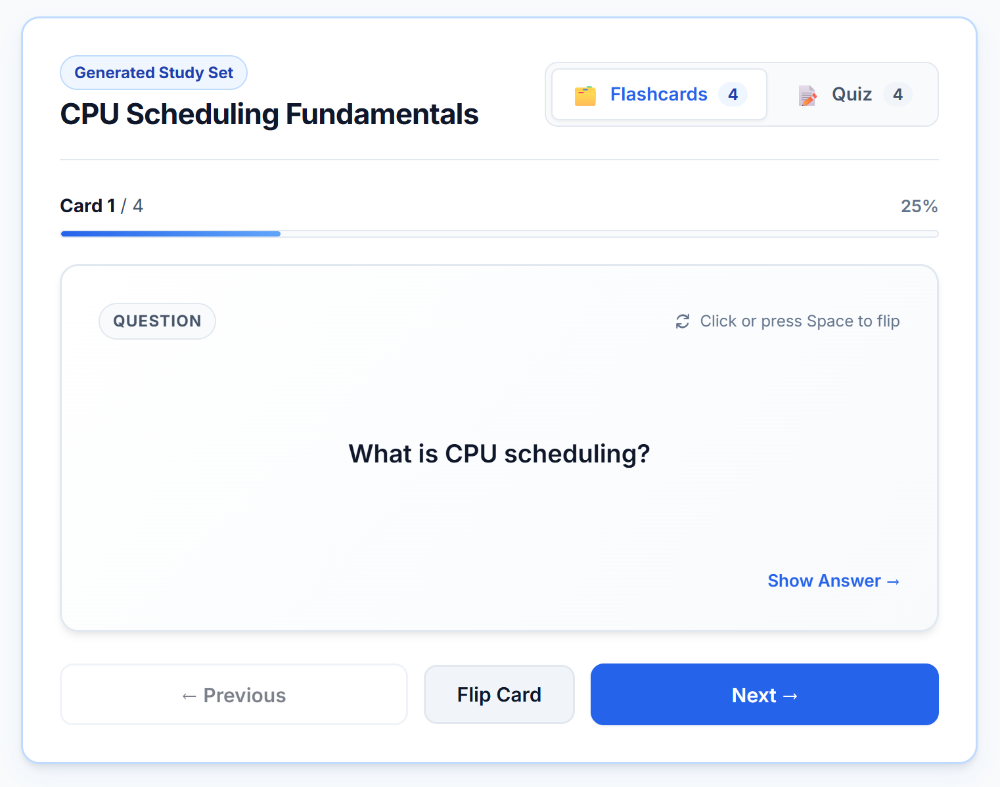
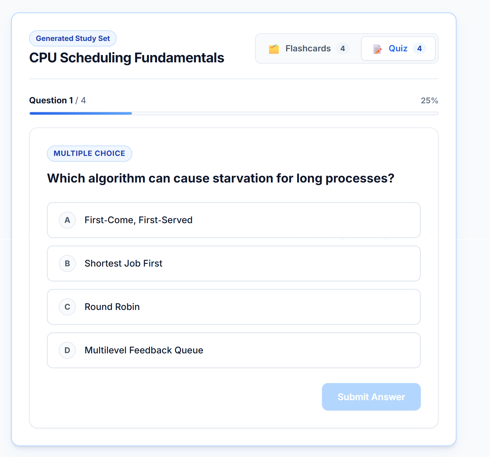
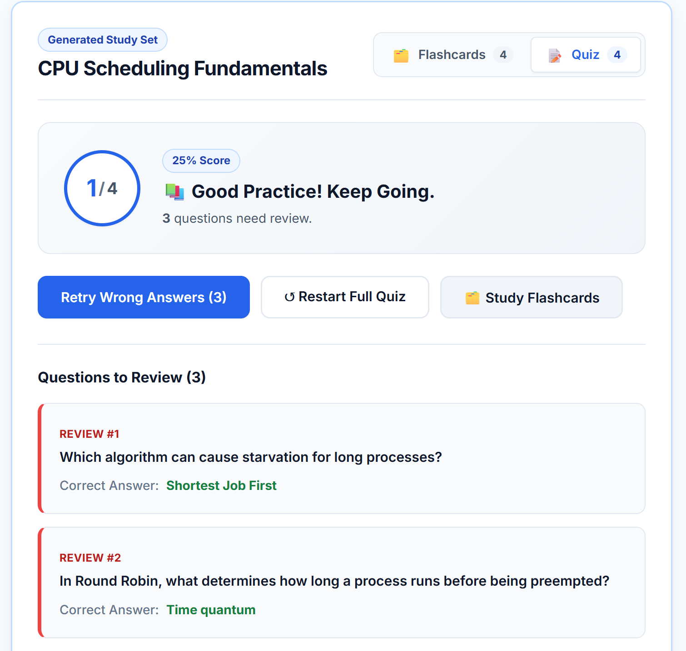
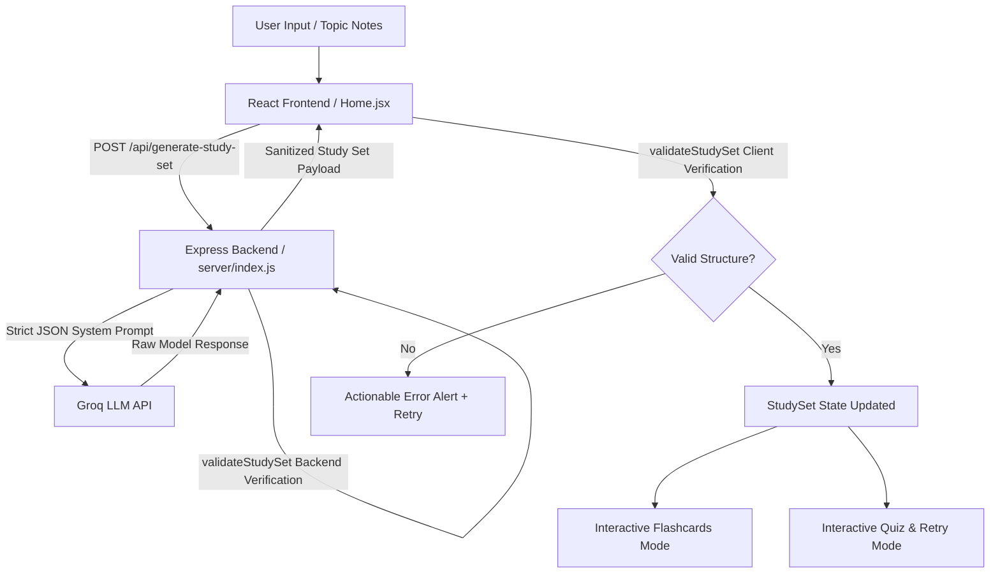

# Student Assistant

> **Technical Assessment / Coding Assignment Submission**  
> An interactive full-stack application that transforms raw notes and topics into structured, 3D interactive flashcards and self-scoring multiple-choice quizzes using a defensive AI data pipeline.

---

## 📸 Screenshots & Demo

Add screenshots of the running application inside the [`docs/screenshots/`](./docs/screenshots/) folder:

| 1. Topic Input & Generator | 2. 3D Interactive Flashcards |
|:---:|:---:|
|  |  |
| *Enter custom text or choose sample topics* | *Flip cards with keyboard/click + progress tracker* |

| 3. Quiz & Instant Feedback | 4. Targeted Retry Session |
|:---:|:---:|
|  |  |
| *Immediate scoring with clear visual feedback* | *Retry only missed questions without extra API calls* |

> *Note: To update or view the screenshots, place your images in `docs/screenshots/` with names `home.png`, `flashcards.png`, `quiz.png`, and `retry.png`.*

---

## 🎯 Assignment Objective & Overview

This project was built as a practical technical assignment to demonstrate:
1. **Defensive AI Engineering**: Interfacing with an LLM (Groq) with strict system prompting, response cleaning, and multi-tier schema validation.
2. **Robust State & Request Management**: Handling network race conditions, in-flight request cancellation (`AbortController`), and fast UI feedback.
3. **Clean Component Architecture**: Modular React components (`Flashcard`, `QuizQuestion`, `QuizResult`, `TopicInput`) with zero component bloat.
4. **Accessible & Responsive UX**: Custom vanilla CSS design system with keyboard navigation, visible focus indicators, mobile responsiveness (tested from 320px to 1440px+), and non-color-dependent feedback states.

---

## 🚀 Key Features

- **AI-Powered Synthesis**: Converts unstructured notes, lecture points, or broad topics into high-yield flashcards and assessment questions.
- **3D Flip Flashcards**: Active recall interface with smooth 3D flip animations, keyboard shortcuts (`Space` / `Enter` / arrows), and progress indicator.
- **Interactive Self-Scoring Quiz**: 4-option multiple-choice quizzes with immediate validation (highlighting selected answer, correct answer, and descriptive feedback).
- **Targeted Wrong-Answer Retry**: Isolates incorrectly answered questions into an instant retry mode without re-querying the LLM.
- **Resilient Error States**: Clear, actionable error messaging with one-click retries and non-blocking recovery.

---

## 🛠️ Tech Stack

- **Frontend**: React 18, Vite 5, Custom Vanilla CSS Design System (no heavy UI libraries).
- **Backend API**: Node.js, Express, CORS, Dotenv.
- **AI Integration**: Groq API (High-speed inference via `openai/gpt-oss-120b`).
- **Validation**: Custom bidirectional schema validation layer (`validateStudySet`).
- **Testing**: Node test runner suites for validation pipeline (`test-pipeline.mjs`) and quiz logic (`test-quiz.mjs`).

---

## ⚙️ Setup & Running Locally

### 1. Prerequisites
- **Node.js**: v18.0.0 or higher
- **npm**: v9.0.0 or higher
- **Groq API Key**: (Free tier key from [console.groq.com](https://console.groq.com/))

### 2. Installation
```bash
# Clone the repository
git clone https://github.com/adarsh062/Study-Assistant.git
cd Study-Assistant

# Install dependencies
npm install
```

### 3. Environment Configuration
Create a `.env` file in the root directory:
```bash
cp .env.example .env
```

Open `.env` and provide your Groq API key:
```env
PORT=5000
GROQ_API_KEY=your_actual_groq_api_key_here
```

### 4. Running the Project
To run both backend API server and frontend Vite development server concurrently:
```bash
npm run dev:all
```

Or run them in separate terminals:
```bash
# Terminal 1 - Backend Server (Port 5000)
npm run server

# Terminal 2 - Frontend Client (Port 5173)
npm run dev
```

Open your browser at **`http://localhost:5173`**.

### 5. Running Automated Tests
```bash
npm test
```

---

## 🔐 Environment Variables

| Variable | Required | Description |
|---|---|---|
| `PORT` | Optional (default: `5000`) | Port for the Express backend API. |
| `GROQ_API_KEY` | **Required** | Secret key for Groq LLM inference. |
| `GROQ_MODEL` | Optional | Model identifier (defaults to `openai/gpt-oss-120b`). |

> **Security Note**: `GROQ_API_KEY` is maintained exclusively on the backend server and never leaked to the client bundle.

---

## 🏗️ Architecture & Data Flow



---

## 🛡️ Error Handling & Defensive Design

| Edge Case / Failure | Handling Strategy |
|---|---|
| **Malformed JSON from AI** | Markdown cleanup regex + safe `try/catch` JSON parse with clear fallback error. |
| **Missing / Incomplete Fields** | `validateStudySet` verifies non-empty title, array bounds, and field types before state updates. |
| **Invalid Quiz Options / Answer** | Enforces exactly 4 distinct options and verifies that `answer` strictly exists in `options`. |
| **Upstream API Downtime / 429** | Backend intercepts API errors and returns descriptive HTTP status codes and friendly user messages. |
| **Race Conditions (Fast Typing / Clicks)** | Frontend uses `AbortController` + sequential request ID tracking to cancel stale in-flight requests. |

---

## 🧪 Automated Testing

The project includes isolated test suites:
- **`test-pipeline.mjs`**: Validates schema compliance, rejects malformed payloads, verifies empty string detection, and tests fallback logic.
- **`test-quiz.mjs`**: Validates scoring logic, answer evaluation, percentage calculations, and targeted retry extraction.

Run all tests:
```bash
npm test
```

---

## ⏱️ Time Allocation

- **Architecture, Setup & API Proxy**: ~1.5 hrs
- **Validation Layer & Defensive Pipeline**: ~2.0 hrs
- **Flashcard 3D Interaction & Quiz Engine**: ~2.5 hrs
- **UI/UX Polish, Accessibility & Responsive Testing**: ~2.0 hrs
- **Total Development**: **~8.0 hrs**

---

## 💡 Notes on AI Usage
AI tools (Antigravity IDE & LLM assistance) were utilized during the development workflow for scaffolding boilerplates and sanity-checking test cases. All architecture, error pipelines, validation rules, component logic, and CSS styling were individually reviewed, refined, and tested for quality assurance.
